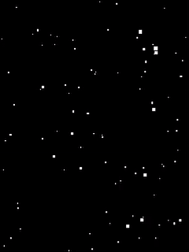

# ESP32-cam + ST7735S + GUIlite

Forked from [m5stickC](https://github.com/nopnop2002/esp-idf-m5stickC)

* Drive 1.44 st7735s TFT Screen（initled without Inverstion:**0x21h**）
* Extract LCD Drive component
* Add GUI component Guilite Sample[HelloStar](https://github.com/idea4good/GuiLiteSamples/tree/master/HelloStar)
* Compile with `CMakeLists.txt`, plz use `idf.py build`
* Remove Power control component `axp192`

Wiring diagram：

| ESP32-CAM | ST7735S     |
| --------- | ----------- |
| GND       | GND         |
| 3.3V      | VCC         |
| GPIO13    | SCL         |
| GPIO15    | SDA(MOSI)   |
| GPIO14    | RES         |
| GPIO16    | DC/RS       |
| GPIO12    | CS          |
| 3.3V      | LED         |



More about [Guilite](https://github.com/idea4good/GuiLite)

---------

# esp-idf-m5stickC

Example code for driving M5StickC ST7735S display using ESP-IDF's SPI driver.

```
git clone https://github.com/nopnop2002/esp-idf-m5stickC
cd esp-idf-m5stickC/
make menuconfig
make flash
```

\*There is no MENU ITEM where this application is peculiar.   


---

# Font File   
You can add your original font file.   
The format of the font file is the FONTX format.   
Your font file is put in font directory.   
Your font file is uploaded to SPIFFS partition using meke flash.   

Please refer [this](http://elm-chan.org/docs/dosv/fontx_e.html) page about FONTX format.   

```
FontxFile yourFont[2];
InitFontx(yourFont,"/spiffs/your_font_file_name","");
uint8_t ascii[10];
strcpy((char *)ascii, "MyFont");
lcdDrawString(dev, yourFont, x, y, ascii, color);
```

It's possible to text rotation and invert.   


It's possible to indicate more than one font at the same time.   
Gothic Font.   


Mincyo Font.   

